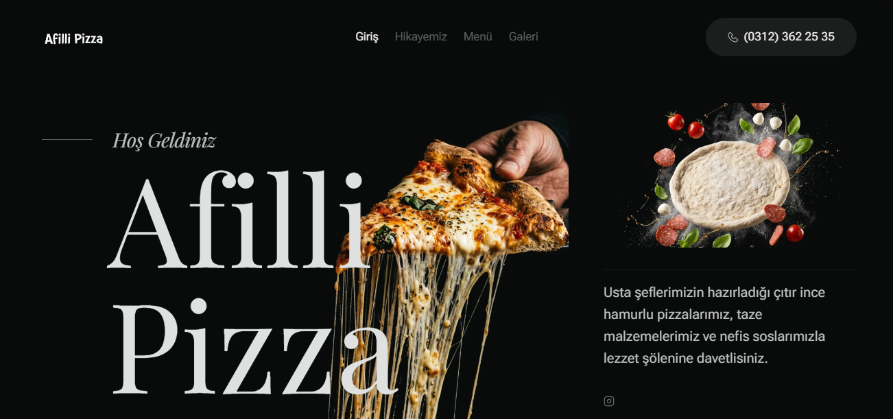
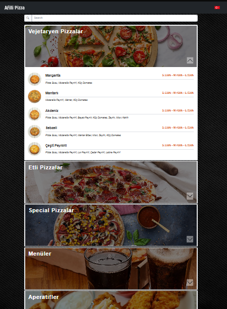

# 🍕 Afilli Pizza - Web & Dijital QR Menü Platformu

Bu çalışma, **Afilli Pizza** restoranı için tasarlanıp geliştirilen ve halen aktif olarak kullanılan ticari web sitesi, interaktif dijital QR menü ve restoran yönetim paneli projesinin **portföy sunumudur**.

---

## 🌐 Canlı Bağlantılar

Projenin canlı versiyonlarını aşağıdaki bağlantılardan inceleyebilirsiniz:

* 🔗 **Ana Web Sitesi:** [afillipizza.com.tr](https://afillipizza.com.tr)
* 📱 **Dijital QR Menü:** [afillipizza.com.tr/qr-menu](https://afillipizza.com.tr/qrmenu)

---

## 📸 Ekran Görüntüleri & Önizleme
| Ana Web Sitesi (Masaüstü & Mobil) | Dijital QR Menü (Mobil) |
| :---: | :---: |
|  |  |

| Yönetim Paneli (CMS) |
| :---: 
|  |

---

## ⭐ Sistem Özellikleri

### 🌐 1. Modern Web Frontend
* **Asenkron Menü Yükleme:** JSON verisi üzerinden `Fetch API` ve `Async/Await` ile çalışan hızlı ve akıcı menü listeleme.
* **Akıllı Navigasyon:** Mobil uyumlu menü geçişleri ve yükseklik zıplamasını önleyen özel sekmeli (`tabbed`) kategori navigasyonu.
* **Mobil Öncelikli & SEO Uyumlu:** Responsive ızgara yapısı, retina/webp görsel desteği ve PWA standartlarında mobil uyumluluk.

### 📱 2. Dijital QR Menü & Müşteri Etkileşimi
* **Çoklu Dil Desteği:** Türkçe, İngilizce, Arapça, Rusça, Bulgarca ve Fransızca dillerinde menü sunumu.

### 🛠️ 3. Yönetim Paneli (Restoran CMS)
* **Oturum Güvenliği:** Güvenli yönetici girişi ve yetkisiz erişim engelleme.
* **Kategori & Ürün CRUD:** Ürün adı, açıklaması, fiyatı, görseli ve kategorilerinin panel üzerinden anlık güncellenmesi.
* **Site Konfigürasyonu:** Site başlığı, açıklaması, favicon ve genel görsellerin yönetim paneli üzerinden kontrolü.

---

## 💻 Kullanılan Teknolojiler & Mimari

* **Frontend:** HTML5, CSS3 (Modüler & Özel Stil Mimarisi), JavaScript (ES6+ Vanilla JS), Bootstrap Icons, SweetAlert2
* **Backend:** PHP (PDO Veritabanı Mimarisi, Session Yönetimi)
* **Veritabanı:** MySQL
* **Mimari:** Client-Side Dynamic Data Rendering + Server-Side Management Panel

---

* 🌐 **Web Sitesi:** [afillipizza.com.tr](https://afillipizza.com.tr)
* 📱 **QR Menü:** [afillipizza.com.tr/qr-menu](https://afillipizza.com.tr/qr-menu)
